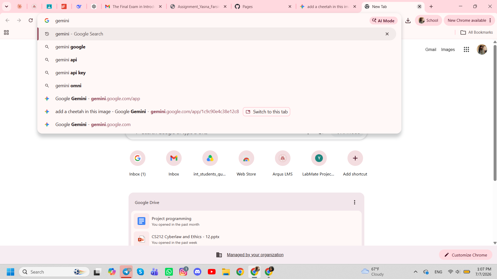
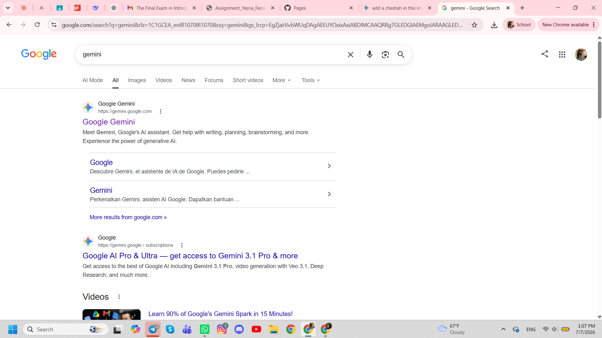
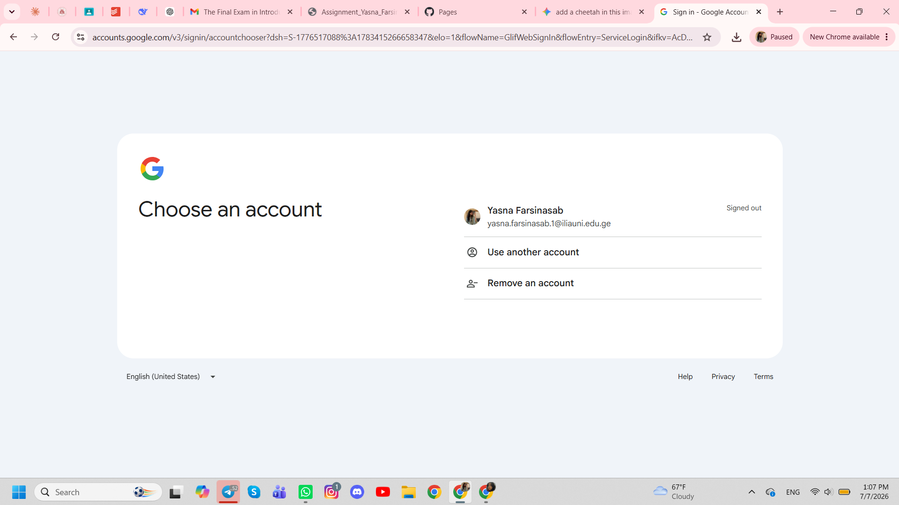
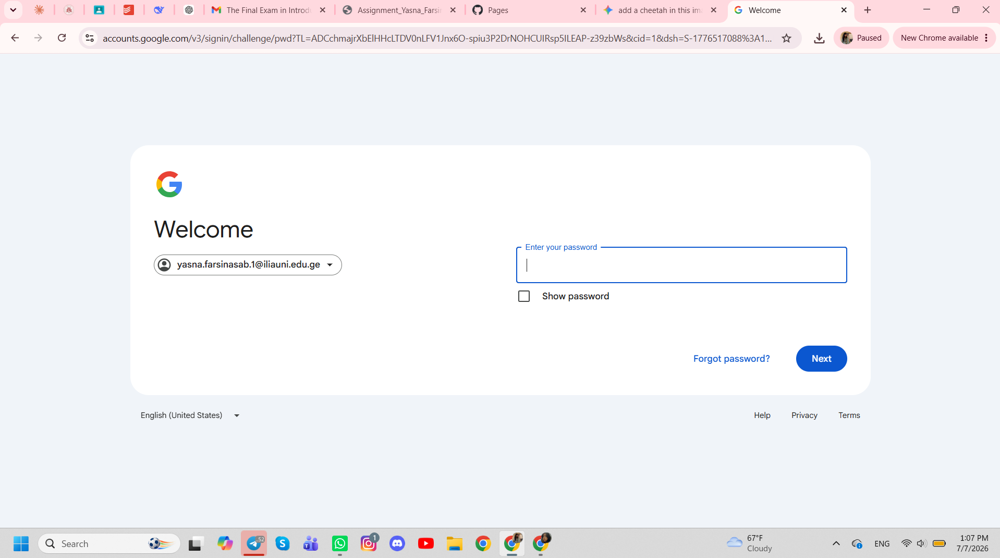
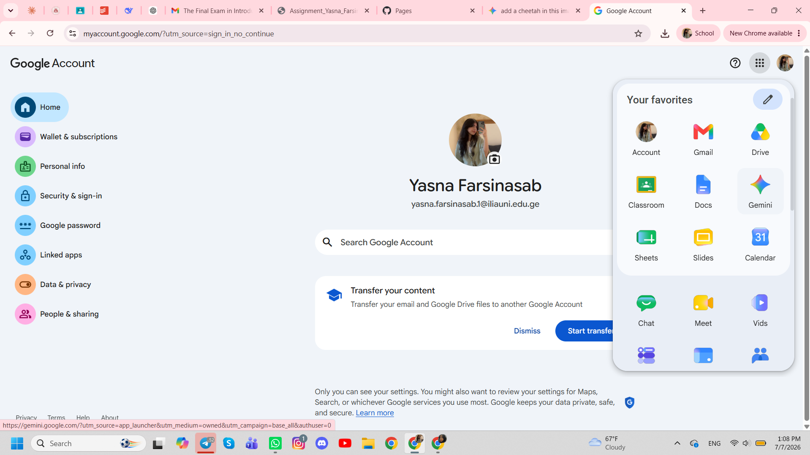
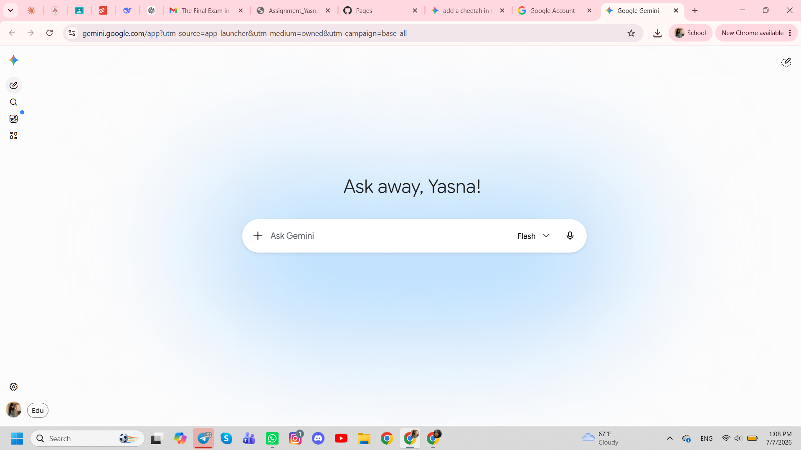
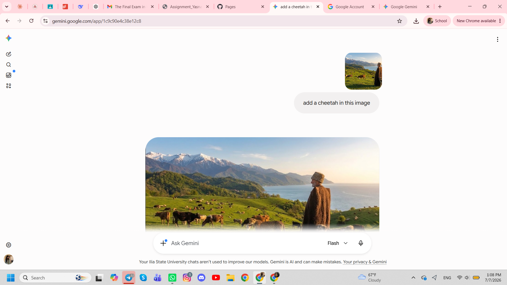
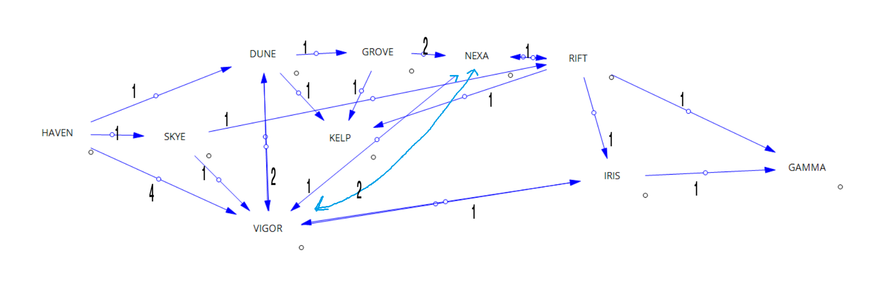

## Task 1: 

## Task 2: User Manual — Adding a Cheetah with Gemini

1. Take a screenshot of the picture and save it locally.
   

2. Search "Gemini" and open the official site (usually the first result).
   

3. Sign in with your Google account.
   

4. Enter your password.
   

5. Once signed in, open Gemini in the browser tab.
   

6. Upload or paste the picture, then ask the AI to add a cheetah into the image.
   

7. Wait for the result.
   

Task three: 

## Task 4: https://yasnansb.github.io/gpa/
